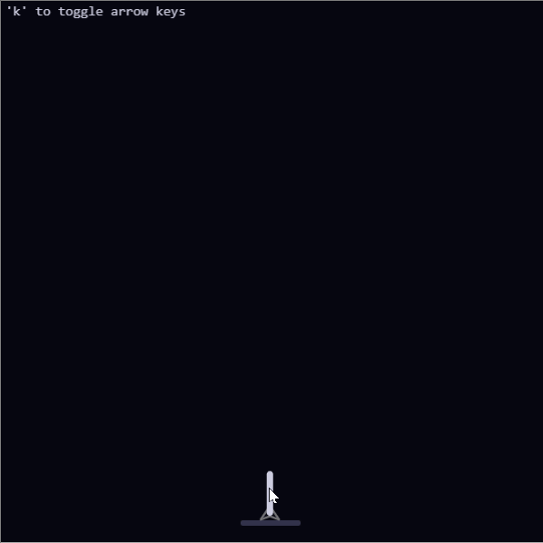

An AI landing a rocket with a physics engine written from scratch in JavaScript, using Verlet integration. The rocket is controlled with a small neural network, trained with [TD3](https://github.com/sfujim/TD3/blob/master/TD3.py).

[Reddit thread.](https://www.reddit.com/r/MachineLearning/comments/bfcbpr/p_landing_a_rocket_from_unfavorable_trajectories/)

Interactive demo: https://sites.google.com/view/rocketlanding/home

